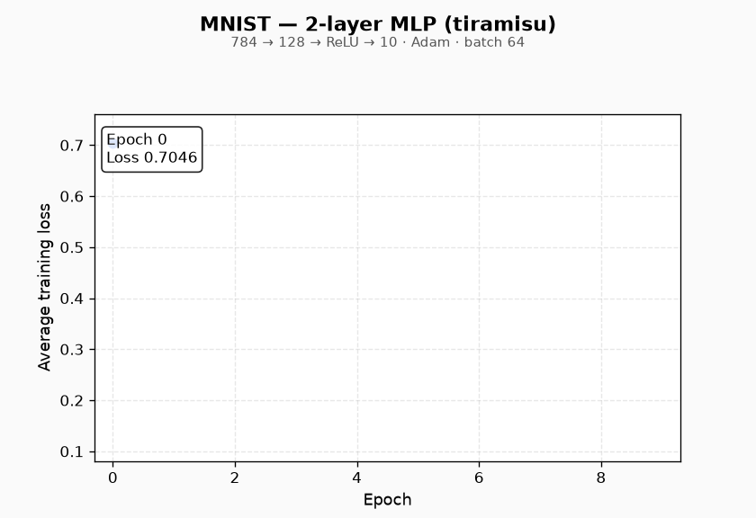

# tiramisu



*A 2-layer MLP (`784 → 128 → ReLU → 10`) training on MNIST with Adam. Generated from the stock [`examples/mnist`](examples/mnist.cpp) binary — regenerate with `python scripts/plot_training.py build/mnist_run.log` (see [Training GIF](#training-gif)).*

**The deep learning framework you can actually read.**

Tiramisu is a from-scratch machine learning stack in **C++20** — about **2,300 lines** of framework code, structured like a production framework but small enough to read in an afternoon.

- **~2,300 lines** of framework code (`core` → `ops` → `autograd` → `nn` → `optim`)
- **Stdlib-only compute** — no Eigen, no BLAS, no PyTorch at link time
- **PyTorch-familiar API** — `Tensor`, `requires_grad`, `backward()`, `Module`, `Linear`, `Adam` (Python and C++)
- **Built to teach** — explicit autograd graph, readable kernels, end-to-end MNIST

Real tensors, real autograd, real training — at a scale you can read cover to cover.

[](https://github.com/dnexdev/tiramisu/actions/workflows/cmake-multi-platform.yml)

---

## Development timeline

What's shipped today vs what's planned. Legend: ✅ shipped · 🚧 in progress · 📋 roadmap

| Phase | | What |
|-------|---|------|
| Foundation | ✅ | `Storage`, `Tensor` views, strides, dtypes |
| Ops | ✅ | Elementwise ops, broadcast, reduce, matmul (AVX2/FMA) |
| Autograd | ✅ | `Node`, `backward()`, `gradcheck`, `NoGradGuard` |
| NN + optim | ✅ | `Linear`, `cross_entropy_loss`, SGD, Adam, MNIST example |
| Normalization | ✅ | `softmax`, `layernorm` forward + backward |
| Batched matmul | ✅ | N-D GEMM with batch broadcast |
| Transformer / GPT | 🚧 | Embedding, MHA, FFN, `TransformerBlock`, GPT |
| CUDA backend | 📋 | `ops/cuda/` placeholder |
| Python bindings | ✅ | `pip install .` — Tensor, autograd, `nn`, `optim` |
| Conv2d, serialize, quant | 📋 | README placeholders today |

---

## API at a glance

If you know PyTorch, you already know most of tiramisu — in **Python** (`pip install .`) or **C++**.

### Autograd

<table>
<tr><th>PyTorch</th><th>Tiramisu (Python)</th><th>Tiramisu (C++)</th></tr>
<tr><td>

```python
x = torch.tensor([2.0], requires_grad=True)
y = x * x + 3.0 * x
y.backward()
print(x.grad)  # tensor([7.])
```

</td><td>

```python
import numpy as np
import tiramisu as tr

x = tr.from_numpy(np.array([2.0], dtype=np.float32))
x.requires_grad = True
y = tr.add(tr.mul(x, x), tr.mul(x, 3.0))
y.backward()
print(x.grad)  # [7.]
```

</td><td>

```cpp
#include "tiramisu/autograd/ops.hpp"

Tensor x({1});
x.at<float>({0}) = 2.0f;
x.set_requires_grad(true);

Tensor y = autograd::add(autograd::mul(x, x),
                         autograd::mul(x, 3.0f));
autograd::backward(y);
// x.grad()->at<float>({0}) == 7.0f
```

</td></tr>
</table>

### Training step

<table>
<tr><th>PyTorch</th><th>Tiramisu (Python)</th><th>Tiramisu (C++)</th></tr>
<tr><td>

```python
optimizer.zero_grad()
logits = model(batch_x)
loss = F.cross_entropy(logits, batch_y)
loss.backward()
optimizer.step()
```

</td><td>

```python
import tiramisu as tr

opt.zero_grad()
h = layer1.forward(batch_x)
h = tr.relu(h)
logits = layer2.forward(h)
loss = tr.nn.cross_entropy_loss(logits, batch_y)
loss.backward()
opt.step()
```

</td><td>

```cpp
opt.zero_grad();
Tensor h = layer1->forward(batch_x);
h = autograd::relu(h);
Tensor logits = layer2->forward(h);
Tensor loss = nn::cross_entropy_loss(logits, batch_y);
autograd::backward(loss);
opt.step();
```

</td></tr>
</table>

### Linear layer

<table>
<tr><th>PyTorch</th><th>Tiramisu (Python)</th><th>Tiramisu (C++)</th></tr>
<tr><td>

```python
layer = nn.Linear(784, 128)
# y = x @ W.T + b
y = layer(x)
```

</td><td>

```python
import tiramisu as tr

layer = tr.nn.Linear(784, 128)
out = layer.forward(x)
```

</td><td>

```cpp
// weight: (in_features, out_features), bias: (out_features,)
Tensor out = autograd::matmul(x, weight);
y = autograd::add(out, bias);  // bias broadcasts over batch
```

</td></tr>
</table>

---

## Quick start (Python)

Requires **Python 3.10+** and a **C++20** compiler.

```bash
pip install .
python -c "import tiramisu as tr; print(tr.nn.Linear(10, 5))"
```

Forward pass with NumPy interop:

```python
import numpy as np
import tiramisu as tr

x = tr.from_numpy(np.random.randn(2, 784).astype(np.float32))
layer = tr.nn.Linear(784, 10)
out = layer.forward(x)
print(out.shape())  # [2, 10]
```

See [`examples/python/`](examples/python/) and [`python/README.md`](python/README.md) for GPT training steps and the full binding reference.

---

## Quick start (C++)

Requires **CMake 3.20+** and a **C++20** compiler.

```bash
cmake -S . -B build -G Ninja -DCMAKE_BUILD_TYPE=Debug
cmake --build build --parallel
ctest --test-dir build --output-on-failure
```

Debug builds enable ASan + UBSan by default (`TIRAMISU_ENABLE_SANITIZERS=ON`).  
Use `-DCMAKE_BUILD_TYPE=Release` for optimized ops (`-O3 -mavx2 -mfma`) without sanitizers.

### Run MNIST

1. Download [MNIST IDX files](http://yann.lecun.com/exdb/mnist/) into `data/`:
   - `train-images-idx3-ubyte`, `train-labels-idx1-ubyte`
   - `t10k-images-idx3-ubyte`, `t10k-labels-idx1-ubyte`
2. Build (above), then:

```bash
cd build/examples && ./mnist
```

Expected: loss decreases over 10 epochs, ~95%+ test accuracy.

---

## Read the whole stack

A guided path through the codebase (~2.3k LOC of libraries):

| # | File | Why read it |
|---|------|-------------|
| 1 | [`core/include/tiramisu/core/tensor.hpp`](core/include/tiramisu/core/tensor.hpp) | Views, strides, autograd hooks |
| 2 | [`ops/cpu/broadcast.cpp`](ops/cpu/broadcast.cpp) | NumPy-style broadcast rules |
| 3 | [`ops/cpu/elementwise.cpp`](ops/cpu/elementwise.cpp) | Stride-0 broadcast trick |
| 4 | [`autograd/src/ops.cpp`](autograd/src/ops.cpp) | `backward()` + wrapper pattern |
| 5 | [`nn/src/linear.cpp`](nn/src/linear.cpp) | One layer: `Y = XW + b` |
| 6 | [`examples/mnist.cpp`](examples/mnist.cpp) | Full training loop |

Compare to [micrograd](https://github.com/karpathy/micrograd) (minimal autograd in Python), [tinygrad](https://github.com/tinygrad/tinygrad) (full stack, large codebase), and [llm.c](https://github.com/karpathy/llm.c) (training-focused C). Tiramisu targets **typed C++**, **modular libraries**, and **MNIST end-to-end** as a readable reference implementation — not production throughput.

---

## Training GIF

Regenerate the README animation after a local training run:

```bash
cd build/examples && ./mnist 2>&1 | tee ../mnist_run.log
pip install -r scripts/requirements.txt   # matplotlib, pillow
python scripts/plot_training.py build/mnist_run.log
```

Output: [`docs/assets/mnist_training.gif`](docs/assets/mnist_training.gif)

---

## Layout

```
core/       Storage, Tensor, dtype, device
ops/cpu/    Forward kernels (elementwise, reduce, matmul, normalization)
autograd/   Differentiable wrappers, backward(), gradcheck
nn/         Module, Linear, loss, LayerNorm, …
optim/      SGD, Adam
python/     pybind11 bindings (`pip install .`)
examples/   hello_tiramisu, mnist, python/
tests/      GoogleTest (fetched by CMake), pytest (`tests/python/`)
```

GoogleTest is the only non-stdlib fetch at configure time. Compute uses the **C++ standard library** only (plus compiler intrinsics for AVX2 in `ops`).
