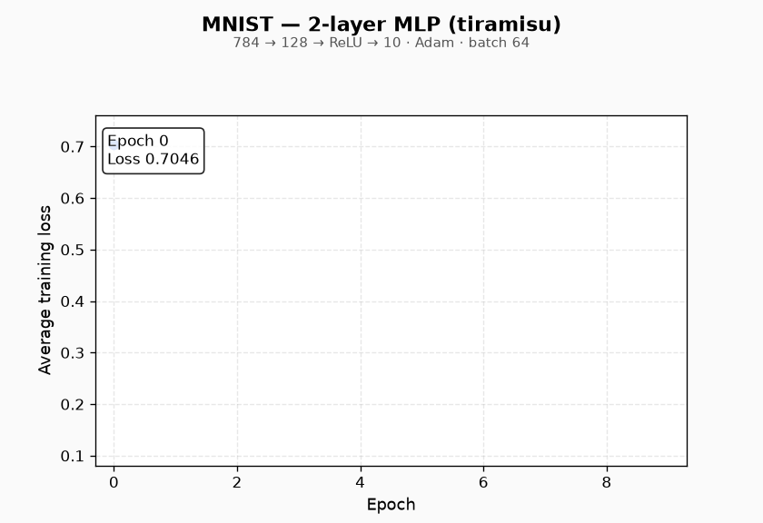

# tiramisu



A from-scratch ML framework in **C++20** — about **5,000 lines** of readable, PyTorch-familiar code with a Python binding.

- Stdlib-only compute (no Eigen, no BLAS, no PyTorch at link time)
- `Tensor`, `requires_grad`, `backward()`, `Module`, `Linear`, `Adam` — Python and C++
- AVX2/FMA matmul on x86, scalar fallback elsewhere
- Optional CUDA backend for GPU training
- End-to-end MNIST and char-level GPT examples

[](https://github.com/dnexdev/tiramisu/actions/workflows/cmake-multi-platform.yml)

## Install

```bash
pip install tiramisu-ml
```

Requires Python 3.10+. Wheels ship for Linux (x86_64, aarch64) and macOS (x86_64, arm64); other platforms build from sdist and need CMake + a C++20 compiler.

## Quick start

```python
import numpy as np
import tiramisu as tr

x = tr.from_numpy(np.random.randn(2, 784).astype(np.float32))
layer = tr.nn.Linear(784, 10)
out = layer.forward(x)
print(out.shape())  # [2, 10]
```

Training step:

```python
opt.zero_grad()
h = tr.relu(layer1.forward(batch_x))
logits = layer2.forward(h)
loss = tr.nn.cross_entropy_loss(logits, batch_y)
loss.backward()
opt.step()
```

C++ mirrors the Python API — see [`examples/mnist.cpp`](examples/mnist.cpp).

## API

**Tensor ops** — `add`, `sub`, `mul`, `div`, `neg`, `matmul`, `sum`, `mean`, `reshape`, `transpose`, `contiguous`, `relu`, `gelu`, `softmax`, `from_numpy`, `backward`

**Modules** — `nn.Linear`, `nn.LayerNorm`, `nn.GPT`, `nn.cross_entropy_loss`

**Optimizers** — `optim.Adam`

Full binding reference in [`python/README.md`](python/README.md).

## Examples

**MNIST** (CPU, ~10 epochs to 95%+):

```bash
cmake -S . -B build -DCMAKE_BUILD_TYPE=Release
cmake --build build --target mnist
./build/examples/mnist
```

Data: [MNIST IDX files](http://yann.lecun.com/exdb/mnist/) in `data/`.

**Char-level GPT** on Tiny Shakespeare:

```bash
cmake --build build --target train_shakespeare
./build/examples/train_shakespeare --preset tiny --epochs 3
```

Presets: `tiny`, `2m`, `10m`. Add `--cuda` for GPU.

## Build from source

```bash
cmake -S . -B build -G Ninja -DCMAKE_BUILD_TYPE=Release
cmake --build build --parallel
ctest --test-dir build --output-on-failure
```

CUDA: `-DTIRAMISU_ENABLE_CUDA=ON`. Debug builds enable ASan+UBSan by default.

## Layout

```
core/       Storage, Tensor, dtype, device
ops/cpu/    Forward kernels (elementwise, reduce, matmul, normalization)
ops/cuda/   Optional CUDA kernels
autograd/   Differentiable wrappers, backward(), gradcheck
nn/         Module, Linear, GPT, LayerNorm, loss
optim/      SGD, Adam, AdamW, grad clipping, cosine LR
python/     pybind11 bindings
serialize/  GPT checkpoint save/load
examples/   hello_tiramisu, mnist, train_shakespeare
```

GoogleTest is the only non-stdlib fetch at configure time. License: MIT.
