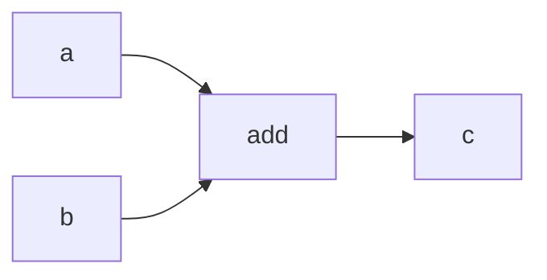

# Building Tiramisu From Scratch

*A guided tour for first-year CS students. You should know C++, basic calculus (derivatives, chain rule), and linear algebra (vectors, matrices, matrix multiply). You do **not** need any prior machine learning background.*

This post walks through how to build **tiramisu** — a small machine learning framework in C++ — layer by layer. We explain *what* each piece does and *why* it exists, then show where the hard bugs hide.

For exhaustive formulas and file references, see [WIKI.md](WIKI.md).

---

## Part 0: Machine learning in plain terms

### What problem are we solving?

Suppose you have inputs \(x\) (a vector of numbers) and you want outputs \(y\) (also numbers). A classic example: \(x\) is a 28×28 grayscale image flattened to 784 pixels, and \(y\) is which digit (0–9) the image shows.

A **hand-written program** might look for loops in pixel patterns. That works poorly for photos, speech, or text.

A **learned program** (a **neural network**) is different: you define a *family* of functions with millions of adjustable numbers called **parameters** (or **weights**). Training means picking parameter values so the function maps your training examples correctly.

### Parameters, forward pass, loss

1. **Forward pass**: plug input \(x\) into the network, get a prediction \(\hat{y}\).
2. **Loss**: a single number measuring how wrong \(\hat{y}\) is compared to the true label \(y\). Bigger loss = worse.
3. **Backward pass**: compute how each parameter would change the loss (its **gradient**).
4. **Update**: nudge each parameter a tiny step in the direction that *reduces* loss.

Repeat steps 1–4 on many examples (an **epoch**) until loss stops dropping. That loop is **training**.

### Gradients (you've seen this in Calc I)

If \(L\) is the loss and \(w\) is one parameter, the **partial derivative** \(\partial L / \partial w\) tells you: "if I increase \(w\) slightly, does \(L\) go up or down, and by how much?"

For a network with many operations chained together, the **chain rule** multiplies local derivatives along the path from \(L\) back to each parameter:

\[
\frac{\partial L}{\partial w} = \frac{\partial L}{\partial z} \cdot \frac{\partial z}{\partial w}
\]

where \(z\) is some intermediate value. **Autograd** (automatic differentiation) does this bookkeeping for you.

### What is a tensor?

In this codebase, a **tensor** is a multi-dimensional array of numbers stored in memory — generalizing scalars (0-D), vectors (1-D), and matrices (2-D) to any rank.

| Rank | Name | Example shape | Meaning |
|------|------|---------------|---------|
| 0 | scalar | `{1}` | a single loss value |
| 1 | vector | `{10}` | 10 class scores |
| 2 | matrix | `{64, 784}` | 64 images, 784 pixels each |
| 3 | 3-D tensor | `{32, 28, 784}` | batch 32, sequence 28, features 784 |

Shape is always listed outer-to-inner in **row-major (C) order**: the last index moves fastest in memory.

### What you're building

**Tiramisu** is a from-scratch C++20 stack — no PyTorch, no TensorFlow, no Eigen for math. The layers, bottom to top:

```
Storage  →  Tensor (view)  →  ops (forward math)  →  autograd (backward)
         →  nn (neural network modules)  →  optim (parameter updates)
```

Build in that order. Each layer only depends on the ones below.

By the end you can:

- Train a digit classifier on **MNIST** (handwritten 0–9)
- Run forward and backward through a **GPT-style transformer** (the architecture behind ChatGPT-style models)

CMake, GoogleTest, and project layout are standard C++ boilerplate — one static library per folder, C++20, `-Wall`. Set that up and move on.

---

## Part 1: Storage and the tensor-as-view

### Storage: who owns the bytes?

`Storage` is a contiguous block of memory — a `std::vector<std::byte>` with alignment suitable for SIMD — plus metadata: data type (`Float32` for now) and device (`CPU`).

When you create a tensor with shape `(2, 3)` and dtype `Float32`, storage allocates \(2 \times 3 \times 4 = 24\) bytes.

### Tensor: a lens, not a container

The crucial design choice: a `Tensor` **does not own** the bytes. It holds:

| Field | Role |
|-------|------|
| `shared_ptr<Storage>` | pointer to the actual memory |
| `shape` | size along each dimension, e.g. `(2, 3)` |
| `strides` | how many elements to skip in memory when you increment each index |
| `offset` | where this view starts inside storage |

**Flat index** from coordinates \((c_0, c_1, \ldots)\):

\[
\text{idx} = \text{offset} + \sum_i c_i \cdot \text{stride}_i
\]

#### Worked example: shape `(2, 3)`, contiguous

Memory layout (row-major): `[1, 2, 3, 4, 5, 6]`

| coord \((row, col)\) | flat idx | value |
|---------------------|----------|-------|
| (0, 0) | 0 | 1 |
| (0, 1) | 1 | 2 |
| (0, 2) | 2 | 3 |
| (1, 0) | 3 | 4 |
| (1, 1) | 4 | 5 |
| (1, 2) | 5 | 6 |

Strides: `(3, 1)` — moving one row skips 3 elements; moving one column skips 1.

#### Why views matter

`transpose()` and `permute()` **only rearrange** `shape` and `strides`. They never copy data. Transposing a `(3, 4)` matrix to `(4, 3)` is instant.

That means:

- **Good**: cheap reshaping of data for different algorithms
- **Hard**: every kernel must respect strides; you cannot assume adjacent memory unless you call `contiguous()`

`contiguous()` copies a strided tensor into fresh row-major layout. Use it before tight SIMD loops (like matrix multiply).

`reshape(new_shape)` is implemented as `contiguous().view(new_shape)` — it may copy if the tensor wasn't already contiguous.

### Autograd state lives on the tensor

Each tensor also carries (via a shared `AutogradState`):

- `requires_grad` — should we track this value for training?
- `grad` — accumulated gradient (same shape as the tensor)
- `grad_fn` — link to the operation that created this tensor (for backward)

When you **copy** a `Tensor` handle, both copies share the same autograd state. That is intentional: if one tensor feeds two branches, gradients from both paths **add** into `.grad()` via `accumulate_grad`.

---

## Part 2: Forward operations

The `ops` library implements **forward** math only: given inputs, compute outputs. No gradients here.

### Elementwise operations

For tensors `a` and `b` of the same (or broadcastable) shape, **elementwise** means you apply the operation independently to each position:

- `add`: \(y_i = a_i + b_i\)
- `mul`: \(y_i = a_i \cdot b_i\)
- `relu`: \(y_i = \max(0, x_i)\) — zero out negatives; keeps positives. A simple non-linearity.
- `exp`, `log`: standard math, applied per element

Implementation: nested loops (or SIMD over contiguous buffers). Straightforward.

### Broadcasting: adding a bias without copying

**Problem**: your data has shape `(64, 10)` — 64 examples, 10 features each. Your bias is shape `(10,)` — one value per feature. You want `data + bias` without manually tiling the bias 64 times.

**NumPy-style rules**:

1. Left-pad the shorter shape with 1s until both have the same rank
2. Output dimension \(i\) = `max(a[i], b[i])`
3. Compatible if, for each \(i\), the dims are equal **or** one side is 1

Example: `(64, 10) + (10,)` → pad bias to `(1, 10)` → output `(64, 10)`.

**The implementation trick**: for any dimension of size 1, set **stride = 0**. When the loop advances along that axis, it reads the same memory address again. No temporary expanded tensor.

```
data strides:  (10, 1)   — 64 rows, 10 cols
bias strides:  (0, 1)   — "repeat" across the 64 rows
```

Put `broadcast_shapes()` in one place (`ops/cpu/broadcast.cpp`) and reuse it from elementwise ops and matmul.

### Reduction: sum and mean

`sum(t)` adds every element into one scalar. `mean(t)` divides by the count. These collapse dimensions — you'll use `mean` on the loss to average over a batch.

---

## Part 3: Autograd — automatic gradients

This is the heart of training. You could hand-write \(\partial L / \partial w\) for every parameter in every network. Nobody does that at scale. **Autograd** builds a graph during the forward pass and walks it backward.

### The computation graph

Each differentiable operation creates a **`Node`**:

```cpp
struct Node {
  std::vector<Tensor> inputs;   // parent tensors
  std::function<std::vector<Tensor>(const Tensor& grad_output)> backward_fn;
};
```

The output tensor gets `requires_grad = true` and `grad_fn` pointing at that node.

Visually, for `c = add(a, b)`:



During backward, we start at `c` and ask: "given \(\partial L / \partial c\), what are \(\partial L / \partial a\) and \(\partial L / \partial b\)?"

### The wrapper pattern

**Forward math lives in `ops::`.** Autograd **wraps** it:

```cpp
Tensor add(const Tensor& a, const Tensor& b) {
  Tensor out = ops::add(a, b);   // compute forward result
  if (grad_enabled() && (a.requires_grad() || b.requires_grad())) {
    auto node = std::make_shared<Node>();
    node->inputs = {a, b};
    node->backward_fn = [a, b](const Tensor& grad_out) {
      return std::vector<Tensor>{
        reduce_grad_to(grad_out, a.shape()),
        reduce_grad_to(grad_out, b.shape()),
      };
    };
    out.set_requires_grad(true);
    out.set_grad_fn(node);
  }
  return out;
}
```

For `add`, \(\partial L / \partial a = \partial L / \partial c\) and same for `b` — but only after fixing shapes if broadcasting happened (next section).

Training code should call `tiramisu::autograd::add`, not `tiramisu::ops::add`.

### The `backward(loss)` algorithm

Given a scalar loss tensor:

1. **Topological sort**: DFS from `loss` along `grad_fn` chains; list every tensor that contributed.
2. **Seed**: set `loss.grad` to a tensor of ones (same shape as loss). For a scalar loss, that's just `{1.0}`.
3. **Reverse walk**: for each tensor `t` (from loss back to inputs):
   - if `t` has a `grad_fn` and non-null `t.grad()`:
   - call `backward_fn(*t.grad())` → one gradient per input
   - for each input with `requires_grad`: `input.accumulate_grad(grads[i])`
4. **`NoGradGuard`**: a thread-local flag that disables graph building during backward (otherwise you'd build a graph of the backward pass).

This is **reverse-mode** autodiff — one backward pass gives gradients for all parameters. Efficient when you have many inputs (weights) and one scalar output (loss).

### `reduce_grad_to` — essential for broadcast backward

**Setup**: forward added `(64, 10)` data and `(10,)` bias. Backward receives `grad_out` with shape `(64, 10)`.

The bias needs a gradient of shape `(10,)`. Each bias entry \(b_j\) affected **all 64 rows**. By the chain rule, gradients from all rows **sum**:

\[
\frac{\partial L}{\partial b_j} = \sum_{i=0}^{63} \frac{\partial L}{\partial y_{i,j}}
\]

`reduce_grad_to(grad_out, target_shape)` repeatedly sums the leading dimension until ranks match:

```
(64, 10)  →  sum over dim 0  →  (10,)
```

Use this in **every** broadcast op's backward (`add`, `mul`, `matmul`, etc.). If you forget it, batch size 1 tests may pass while real training silently gets wrong bias gradients.

### `mul` backward (slightly less obvious than `add`)

If \(y = a \odot b\) (elementwise product):

\[
\frac{\partial L}{\partial a} = \frac{\partial L}{\partial y} \odot b, \qquad
\frac{\partial L}{\partial b} = \frac{\partial L}{\partial y} \odot a
\]

Again, `reduce_grad_to` to match original shapes.

### `gradcheck` — your safety net

To verify a backward implementation, compare **analytic** gradients (from autograd) to **numerical** gradients (finite differences):

\[
\frac{\partial f}{\partial x_i} \approx \frac{f(x + \epsilon e_i) - f(x - \epsilon e_i)}{2\epsilon}
\]

If they match within tolerance, your backward is likely correct. Use this on every new op before building larger modules on top.

---

## Part 4: Matrix multiply and linear layers

### What matmul does

For 2-D matrices \(A \in \mathbb{R}^{M \times K}\) and \(B \in \mathbb{R}^{K \times N}\):

\[
C_{m,n} = \sum_{k=0}^{K-1} A_{m,k} \cdot B_{k,n}
\]

Each output entry is a **dot product** of a row of \(A\) with a column of \(B\).

Start with a plain triple loop. Make it pass tests. Then optimize: 64×64×64 tiles, AVX2 `_mm256_fmadd_ps`, compile `ops` with `-O3 -mavx2 -mfma`.

### Batched matmul

Neural networks rarely use bare 2-D matrices. A **batch** of 64 images might be shape `(64, 784)`. A linear layer multiplies each row:

```
(64, 784) @ (784, 128)  →  (64, 128)
```

General rule: treat **all leading dimensions** as a batch prefix. The last two dimensions are the matrix. Batch prefixes can broadcast between operands.

Example: `(2, 4, 3) @ (4, 3, 5) → (2, 4, 4, 5)`.

Precompute byte offsets for each batch slice (an "odometer" over batch indices) once, then run GEMM per slice.

### Matmul backward

For \(C = AB\) (on the last two dims):

\[
\frac{\partial L}{\partial A} = \frac{\partial L}{\partial C}\, B^\top, \qquad
\frac{\partial L}{\partial B} = A^\top \frac{\partial L}{\partial C}
\]

Here \(B^\top\) means swap the last two dimensions. If batch dimensions were broadcast (e.g. shared weight matrix across batch), sum those extra dims with `reduce_grad_to`.

**Intuition**: if \(C\) depends on \(A\) through \(C = AB\), a small change in \(A_{m,k}\) affects all \(C_{m,*}\) via row \(m\) of \(C\), weighted by \(B\). The formula above is the compact expression of that.

### Linear layer = learned affine map

A **fully connected (linear) layer** implements:

\[
Y = X W + b
\]

- \(X\): shape `(..., d_in)` — inputs
- \(W\): shape `(d_in, d_out)` — **weight matrix** (learned)
- \(b\): shape `(d_out,)` — **bias** (learned)
- \(Y\): shape `(..., d_out)` — outputs

In code: `matmul(x, weight)` then `add(..., bias)` with broadcasting.

`W` and `b` are **`Parameter`** objects — tensors with `requires_grad = true`, initialized randomly (Kaiming uniform in this project: scale by \(\sqrt{2 / \text{fan\_in}}\) for ReLU-friendly starts).

Stacking linear layers with non-linearities between them gives a **multi-layer perceptron (MLP)** — enough for MNIST.

---

## Part 5: Your first training loop (MNIST)

### The task

**MNIST**: 60,000 training images of handwritten digits, 28×28 pixels, labels 0–9.

Pipeline:

```
flatten image (784,)  →  Linear(784, 128)  →  ReLU  →  Linear(128, 10)  →  logits
```

**Logits** are 10 raw scores (one per class). Higher score = model thinks that class is more likely. They are *not* probabilities yet.

### Softmax and cross-entropy (classification loss)

**Softmax** turns logits \(\mathbf{z}\) into probabilities:

\[
p_i = \frac{e^{z_i}}{\sum_j e^{z_j}}
\]

**Numerical trick**: subtract \(\max_j z_j\) before exponentiating so values stay finite.

**Cross-entropy loss** for one example with true class \(y\):

\[
\mathcal{L} = -\log p_y
\]

If the model assigns high probability to the correct class, \(-\log p_y\) is small. If it's confident but wrong, loss explodes.

For a batch of \(B\) examples, we average:

\[
\mathcal{L} = -\frac{1}{B} \sum_{i=1}^{B} \log p_{i, y_i}
\]

**Backward** (implemented in `nn/src/loss.cpp`): with softmax probabilities \(p\) stored from forward,

\[
\frac{\partial \mathcal{L}}{\partial z_{i,c}} = \frac{1}{B}(p_{i,c} - \mathbb{1}[c = y_i])
\]

The gradient pushes logits for the correct class down and others up — exactly what you want for classification.

### Optimizers: actually changing the weights

After `backward(loss)`, each parameter `p` has `p.grad()` — same shape as `p`, telling you how loss changes w.r.t. `p`.

**SGD** (stochastic gradient descent):

\[
p \leftarrow p - \eta \cdot \nabla_p L
\]

\(\eta\) is the **learning rate** — step size. Too large: diverge. Too small: learn slowly.

**Adam** keeps running averages of gradients and squared gradients (momentum + adaptive per-parameter scaling). More forgiving learning rate; default choice in many projects.

Each training step:

```cpp
optimizer.zero_grad();   // clear old gradients
Tensor loss = ...;       // forward
backward(loss);          // fill .grad() on parameters
optimizer.step();        // p -= lr * grad (or Adam variant)
```

See [`examples/mnist.cpp`](../examples/mnist.cpp) for loading IDX files, batching with `slice`, and the full loop.

---

## Part 6: Softmax and LayerNorm (in depth)

These appear in transformers. Understanding them now saves pain later.

### Softmax backward (why attention is finicky)

Forward (one row): \(p_i = e^{x_i - m} / \sum_j e^{x_j - m}\) with \(m = \max_j x_j\).

Backward with upstream gradient \(g_i = \partial L / \partial p_i\):

\[
\frac{\partial L}{\partial x_i} = p_i \left(g_i - \sum_j g_j p_j\right)
\]

The term \(-\sum_j g_j p_j\) couples all positions — softmax is **not** elementwise. If you wrongly implement backward as `grad * p`, attention weights won't train.

**Snapshot** the forward probabilities \(p\) and use them in backward; don't recompute from \(x\) alone.

### LayerNorm — stabilizing activations

Deep networks suffer if activations have wildly different scales across features. **Layer normalization** re-centers and rescales each **group** of features.

For a vector \(\mathbf{x} \in \mathbb{R}^N\) (one row — in transformers, the \(d_\text{model}\) features at one position):

\[
\mu = \frac{1}{N}\sum_{i=1}^{N} x_i, \qquad
\sigma^2 = \frac{1}{N}\sum_{i=1}^{N} (x_i - \mu)^2
\]
\[
\hat{x}_i = \frac{x_i - \mu}{\sqrt{\sigma^2 + \epsilon}}, \qquad
y_i = \gamma_i \hat{x}_i + \beta_i
\]

\(\gamma, \beta\) are **learned** per-feature scale and shift. \(\epsilon \approx 10^{-5}\) avoids division by zero.

For tensor shape `(batch, seq, d_model)`, normalization runs over the last dimension \(d_\text{model}\) independently for each `(batch, seq)` position.

Backward recomputes \(\mu, \sigma^2, \hat{x}\) from saved input and applies the chain rule through mean and variance. Tedious but standard — test with `gradcheck`.

---

## Part 7: The shape-op trap (silent graph breaks)

This is the most insidious bug when building transformers. **Read this section twice.**

### Views vs. the autograd graph

`Tensor::permute`, `Tensor::reshape`, `Tensor::transpose` create new **view** objects. They copy shape/strides metadata but **do not attach `grad_fn`**. Autograd doesn't know the output came from the input.

```cpp
Tensor q = w_q.forward(x);
Tensor heads = q.reshape({B, S, H, d_k}).permute({0, 2, 1, 3});
```

Forward looks correct. Backward **stops** at `reshape` — no gradient reaches `x` or the linear weights. Training appears to run; weights don't learn.

### Fix: `autograd::reshape`, `autograd::permute`, etc.

Autograd wrappers:

1. Call the `Tensor` method for forward
2. Attach a `Node` whose backward **inverts** the transform

| Op | Backward |
|----|----------|
| `reshape` | `grad_out.reshape(input_shape)` |
| `permute` | `grad_out.permute(inverse_permutation)` |
| `contiguous` | scatter flat grad back into strided layout of input |

**Rule**: anything that must receive gradients during training goes through `autograd::`, not raw `Tensor::`.

### `merge_heads` — when clever views still fail

After attention, context has shape `(B, H, S, d_k)` — batch, heads, sequence, head dimension. You need `(B, S, D)` with \(D = H \cdot d_k\) for the output projection.

Natural code:

```cpp
context.permute({0, 2, 1, 3}).reshape({B, S, D});
```

Even with autograd wrappers, this chain (view → possible contiguous copy → `Linear`) broke gradient checks through the output projection in practice.

**Fix**: dedicated `autograd::merge_heads` with explicit forward copy:

```
out[b, s, h * d_k + d] = x[b, h, s, d]
```

Backward **scatter-adds** into the inverse layout. Verbose, but correct. When views and autograd interact badly, prefer an explicit copy op with a hand-written backward.

---

## Part 8: Embeddings — from token IDs to vectors

### What is a token?

Language models don't feed raw strings into matrix multiply. Text is split into **tokens** (words, subwords, or characters), each mapped to an integer ID.

Example: `"hello world"` → tokens `[15496, 995]` (IDs depend on the vocabulary).

An **embedding layer** is a lookup table `W` of shape `(vocab_size, d_model)`. Token ID `j` selects row `W[j, :]`, a vector of length `d_model`.

For a batch of sequences, shape `(batch, seq)` of IDs → output `(batch, seq, d_model)`.

### Forward: gather

\[
\text{out}[b,s,:] = W[\text{token}[b,s], :]
\]

### Backward: scatter-add

Only **weights** get gradients (token IDs are discrete — not differentiable):

\[
\frac{\partial L}{\partial W[j,:]} \mathrel{+}= \sum_{(b,s)\,:\,\text{token}[b,s]=j} \frac{\partial L}{\partial \text{out}[b,s,:]}
\]

If the same token appears twice in a sequence, gradients **add** for that row.

**Do not** implement embedding as `one_hot(token) @ W` — that's correct mathematically but wastes memory and time.

In this codebase, token IDs are stored as `float32` and cast to integer at lookup. Test gradients on the **weight matrix**, not on token indices.

### Positional embeddings

Transformers also add **position** information — which word is first, second, etc. Tiramisu's GPT uses a second embedding table indexed by position `0, 1, ..., seq_len-1`, added to token embeddings:

\[
x = \text{tok\_emb}(\text{ids}) + \text{pos\_emb}([0, 1, \ldots, S-1])
\]

---

## Part 9: Multi-head attention — the core of transformers

### Intuition

For each position in a sequence, attention asks: **"which other positions should I look at, and how much?"**

1. Build **Query** \(Q\), **Key** \(K\), **Value** \(V\) from the input (three linear projections).
2. Compare queries to keys (dot products) → **attention scores**.
3. Softmax → **attention weights** (non-negative, sum to 1 per query position).
4. Weighted sum of values → **context** vector per position.

**Multi-head** means running several attention operations in parallel with smaller dimensions, then concatenating — different heads can learn different relationships (syntax vs. position vs. semantics).

### Shapes (batch \(B\), sequence \(S\), model dim \(D\), heads \(H\), head dim \(d_k = D/H\))

```
x: (B, S, D)
Q, K, V: each (B, S, D) after linear projections
reshape/split: (B, H, S, d_k)
scores = Q @ K^T: (B, H, S, S)   — each query position vs. each key position
weights = softmax(scores): (B, H, S, S)
context = weights @ V: (B, H, S, d_k)
merge_heads → (B, S, D)
output = W_o(context): (B, S, D)
```

### Scaling

Dot products grow with dimension. Divide scores by \(\sqrt{d_k}\):

\[
\text{scores} = \frac{Q K^\top}{\sqrt{d_k}}
\]

Without scaling, softmax saturates (one weight ≈ 1, rest ≈ 0) and gradients vanish.

### Causal (autoregressive) mask

**GPT** predicts the next token. Position \(i\) must **not** attend to future positions \(j > i\) (that would be cheating at training time).

Add a large negative value to masked entries before softmax:

```
if j > i: scores[b,h,i,j] += -1e9
```

Use `-1e9`, not `-inf` — `-inf` can produce NaNs in edge cases; `-1e9` makes softmax weights effectively zero.

After softmax, weight from position \(i\) to position \(j > i\) is ≈ 0.

**Test**: change input at time \(t\); outputs at times \(< t\) should be unchanged.

### Implementation checklist

All of these must use `autograd::` ops:

- Linear projections for Q, K, V, output
- `autograd::reshape` / split for heads
- `matmul`, `div` (scaling), `add` (mask)
- `softmax`
- `merge_heads` (not raw permute+reshape chain)

---

## Part 10: Transformer block and GPT

### Residual connections

Very deep networks are hard to train — gradients shrink or explode. A **residual** (skip) connection adds the input back:

\[
\text{out} = x + \text{Sublayer}(x)
\]

Even if the sublayer learns near-zero, the identity path carries signal forward and gradients backward.

### Pre-norm transformer block

Tiramisu uses **pre-norm** (LayerNorm before each sublayer):

```
h1 = x + Attention(LayerNorm(x))
out = h1 + FeedForward(LayerNorm(h1))
```

Alternative **post-norm** applies LayerNorm after the residual; pre-norm is often more stable early in training.

`x` appears **twice** in the graph (skip + sublayer input). Gradients add through `accumulate_grad` — don't unnecessarily clone `x`.

### Feed-forward network (FFN)

Per position, independently:

```
FFN(x) = W_2 · GELU(W_1 · x + b_1) + b_2
```

Typically \(W_1\) expands \(D \to 4D\), \(W_2\) projects \(4D \to D\). **GELU** is a smooth non-linearity (Gaussian Error Linear Unit); GPT-2 uses a tanh approximation.

### Full GPT forward

```
token_ids (B, S)
  → token embedding + positional embedding  →  (B, S, D)
  → repeat N times: TransformerBlock
  → final LayerNorm
  → lm_head (linear D → vocab_size)  →  logits (B, S, vocab)
```

**Language modeling**: at each position \(s\), logits \([s, :]\) predict the **next** token. Training pairs input tokens with targets shifted by one.

### Training pitfall: flattening logits

Cross-entropy expects a 2-D tensor `(num_examples, num_classes)`. Logits are `(B, S, vocab)`. Flatten with **`autograd::reshape`**:

```cpp
Tensor flat_logits = autograd::reshape(logits, {B * S, vocab_size});
Tensor flat_targets = ...;  // shape (B * S,)
Tensor loss = cross_entropy_loss(flat_logits, flat_targets);
backward(loss);
```

`Tensor::reshape` **severs the graph** — embeddings and lower layers get zero gradient. One line, total failure.

---

## Part 11: How to verify each layer

Build confidence incrementally. Don't stack GPT on untested matmul.

| Stage | What to test |
|-------|----------------|
| Tensor views | `permute` then read values; `contiguous` matches original |
| Ops forward | 2×2 matmul by hand; `relu(-1) == 0` |
| Broadcast | `(64,10) + (10,)` shape and values |
| Autograd | `gradcheck` on `add`, `mul`, `matmul` |
| Broadcast backward | bias grad shape `(10,)` after `(64,10) + (10,)` |
| Linear | `gradcheck` on `sum(linear(x))` w.r.t. `x` and weights |
| Softmax / LN | `gradcheck` on small tensors |
| MHA | causal mask test; `gradcheck` on `sum(mha(x))` |
| Transformer block | every `parameters()` has non-null `.grad()` after `backward` |
| GPT + loss | `tok_emb` and `lm_head` weights get **non-zero** grad |

`gradcheck` uses small tensors (`seq ≤ 4`, `d_model ≤ 16`). Deep transformer stacks may need looser tolerance — deep composition amplifies floating-point error; that isn't always a wrong formula.

---

## Part 12: Build order checklist

1. **Storage** + **Tensor** (views, `contiguous`, `permute`, `slice`)
2. **ops**: broadcast, elementwise, `sum`/`mean`, 2-D `matmul`
3. **autograd**: wrap ops, `backward()`, `reduce_grad_to`, `NoGradGuard`
4. **gradcheck**
5. **nn**: `Linear`, `Module`/`Parameter`, `cross_entropy_loss`
6. **optim**: SGD, Adam → **MNIST** end-to-end
7. Batched **matmul**, **softmax**, **layernorm** (+ autograd)
8. **autograd** shape ops + **`merge_heads`**
9. **Embedding**, **MultiHeadAttention**, **FeedForward**, **TransformerBlock**, **GPT**
10. Tests at **every** step before adding the next layer

---

## Part 13: What this project does not include (yet)

Don't block your learning on these — they're placeholders or future work:

- GPU / CUDA (`ops/cuda/` is a stub)
- Convolutional layers (Conv2d)
- AdamW, learning-rate schedules
- Model save/load, Python bindings
- Training on a full text corpus (Shakespeare demo in README is aspirational)

MNIST proves the training loop works. GPT module tests prove transformer math is wired. Running a real language-model training job is the next step after you understand this stack.

---

## Further reading

| Resource | Contents |
|----------|----------|
| [WIKI.md](WIKI.md) | Every backward formula, repo map, test catalog |
| [README.md](../README.md) | Build commands, project overview |
| [examples/mnist.cpp](../examples/mnist.cpp) | Complete training loop |

---

## Closing thought

Modern ML frameworks hide enormous complexity behind `loss.backward()`. Building tiramisu strips that away:

- **Tensors** are strided views over memory — cheap to reshape, easy to get wrong in kernels.
- **Broadcasting** needs stride-0 forward and sum-reduction backward.
- **Autograd** is a graph of lambdas walked in reverse.
- **Shape operations** can silently detach that graph unless you wrap them.
- **Attention** is matmul + softmax + masking, repeated per head.
- **GPT** is embeddings + stacked transformer blocks + a vocabulary projection.

The architecture diagrams look impressive. The bugs are in broadcasting, matmul gradients, softmax backward, and one `reshape` that forgot to record history. Learn those deeply — everything else is composition.
