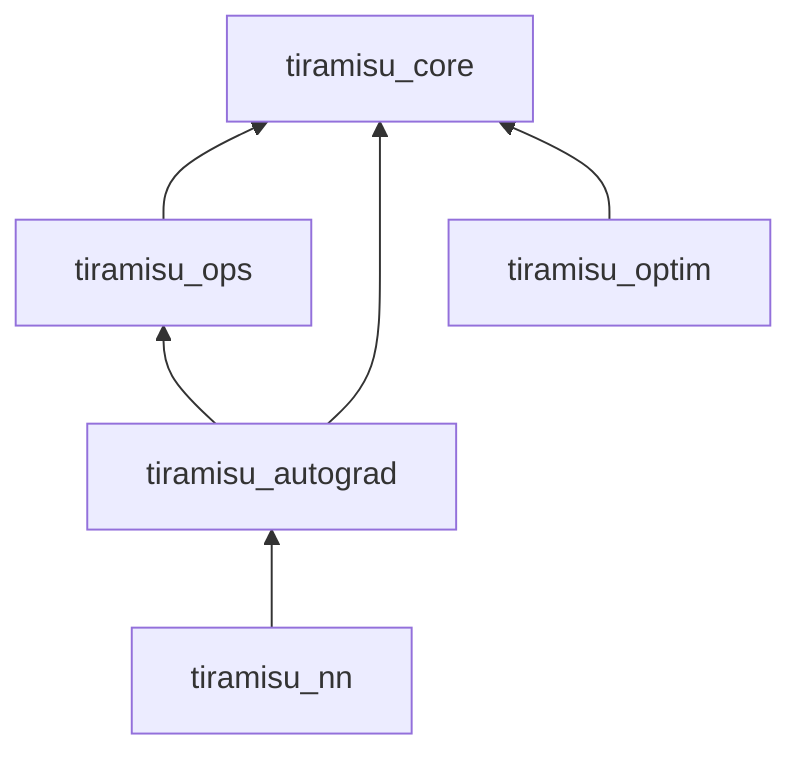
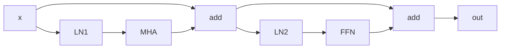
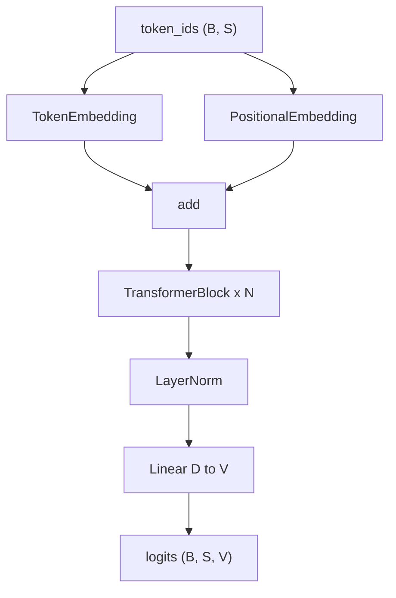

# Tiramisu Wiki

A from-scratch reference for the tiramisu machine learning framework: how it is built, how data flows through it, and the mathematics behind every layer from `Storage` through GPT.

---

## Table of Contents

1. [Introduction and History](#1-introduction-and-history)
2. [Repository Map and Dependency Graph](#2-repository-map-and-dependency-graph)
3. [Build System and CI](#3-build-system-and-ci)
4. [Core: Storage and Tensor](#4-core-storage-and-tensor)
5. [Broadcasting Semantics](#5-broadcasting-semantics)
6. [Ops Layer — Forward Math](#6-ops-layer--forward-math)
7. [Autograd Engine](#7-autograd-engine)
   - 7.1 [Backward Formulas](#71-backward-formulas-every-wrapper)
   - 7.2 [Gradcheck](#72-gradcheck)
8. [NN Module System](#8-nn-module-system)
   - 8.1 [Linear](#81-linear)
   - 8.2 [Embedding](#82-embedding)
   - 8.3 [LayerNorm](#83-layernorm)
   - 8.4 [Multi-Head Attention](#84-multi-head-attention)
   - 8.5 [FeedForward](#85-feedforward)
   - 8.6 [TransformerBlock](#86-transformerblock)
   - 8.7 [GPT](#87-gpt)
9. [Loss Functions](#9-loss-functions)
10. [Optimizers](#10-optimizers)
11. [End-to-End Training Walkthrough](#11-end-to-end-training-walkthrough)
12. [Test Suite Map](#12-test-suite-map)
13. [Known Limitations and Design Tradeoffs](#13-known-limitations-and-design-tradeoffs)
14. [Future Work](#14-future-work)

---

## 1. Introduction and History

### What tiramisu is

**tiramisu** is a machine learning framework written in **C++20** from first principles. It provides:

- A **tensor** abstraction with row-major strided views over owned byte buffers
- **CPU compute kernels** with AVX2/FMA SIMD (elementwise, reduce, batched matmul, softmax, layernorm)
- A **reverse-mode autograd** engine built on explicit computation graphs
- **Neural network modules** from `Linear` through a full **GPT-style transformer**
- **SGD** and **Adam** optimizers
- A **GoogleTest** suite (101 tests at time of writing)

There are **no** external ML dependencies (no PyTorch, no Eigen for compute). GoogleTest is fetched at configure time for tests only.

### Evolution narrative

The codebase grew in layers, each adding capability on top of the previous:

| Phase | What was built | Why it matters |
|-------|----------------|----------------|
| **Foundation** | `Storage`, `Tensor`, dtypes, device | Everything is a view; ops never own data unless they allocate output |
| **Ops** | Scalar/SIMD kernels in `ops/cpu/` | Forward math lives here; autograd wraps, does not reimplement |
| **Autograd** | `Node`, `backward()`, `gradcheck` | Differentiable training; every op has an analytic backward |
| **NN + Optim** | `Linear`, `Sequential`, `cross_entropy_loss`, SGD, Adam | MNIST end-to-end demo |
| **Normalization** | `softmax`, `layernorm` forward + backward | Needed for transformers |
| **Batched matmul** | N-D matmul with batch broadcast, precomputed offsets | `(batch, seq, d) @ (d, d')` for Linear and attention |
| **Transformer stack** | GELU, `reshape`/negative dims, `Embedding`, MHA, FFN, `TransformerBlock`, `GPT` | Full causal language-model forward + backward |

### Implemented vs aspirational

The root [`README.md`](../README.md) describes a broader vision. **What actually exists in the tree today:**

| Claimed in README | Status |
|-------------------|--------|
| `core/` Storage, Tensor | **Implemented** |
| `ops/cpu/` elementwise, reduce, matmul | **Implemented** (no conv) |
| `ops/cuda/` | **Placeholder** (README only) |
| `autograd/` backward, gradcheck | **Implemented** |
| `nn/` Linear, Embedding, transformer | **Implemented** (no Conv2d) |
| `optim/` SGD, Adam | **Implemented** (no AdamW, no LR scheduler) |
| `serialize/`, `quant/`, `python/` | **Placeholder** |
| `bench/` | **Placeholder** (not in default CMake) |
| `examples/train_shakespeare` | **Not implemented** (MNIST only) |

---

## 2. Repository Map and Dependency Graph

### Directory layout

```
tiramisu/
├── core/           Storage, Tensor, dtype, device, version
├── ops/
│   ├── cpu/        Forward kernels (elementwise, reduce, matmul, broadcast, normalization)
│   └── cuda/       Placeholder
├── autograd/       Differentiable wrappers, backward(), gradcheck, NoGradGuard
├── nn/             Module, Linear, Embedding, LayerNorm, MHA, FFN, TransformerBlock, GPT, loss
├── optim/          SGD, Adam
├── tests/          25 test files, 101 TEST cases, single binary
├── examples/       hello_tiramisu, mnist
├── data/           MNIST IDX files (gitignored, user-provided)
├── bench/          Placeholder
├── quant/          Placeholder
├── serialize/      Placeholder
└── python/         Placeholder
```

### Library dependency graph



- **`tiramisu_core`**: no internal tiramisu deps; linked by everything
- **`tiramisu_ops`**: forward math only; links `core`; compiled with `-O3 -mavx2 -mfma`
- **`tiramisu_autograd`**: wraps `ops::`; implements `backward()`
- **`tiramisu_nn`**: modules call `autograd::` ops, never `ops::` directly (except via wrappers)
- **`tiramisu_optim`**: reads/writes `Tensor::data()` and `.grad()`; links `core` only

### Key source files per library

#### core (`core/`)

| File | Role |
|------|------|
| [`core/include/tiramisu/core/tensor.hpp`](../core/include/tiramisu/core/tensor.hpp) | `Tensor` view class, autograd hooks |
| [`core/include/tiramisu/core/storage.hpp`](../core/include/tiramisu/core/storage.hpp) | Byte buffer ownership |
| [`core/include/tiramisu/core/node.hpp`](../core/include/tiramisu/core/node.hpp) | `Node { inputs, backward_fn }` |
| [`core/src/tensor.cpp`](../core/src/tensor.cpp) | `permute`, `reshape`, `contiguous`, `accumulate_grad` |
| [`core/src/storage.cpp`](../core/src/storage.cpp) | Aligned allocation |
| [`core/src/dtype.cpp`](../core/src/dtype.cpp) | `Float32`, `Int32`, size helpers |

#### ops (`ops/`)

| File | Role |
|------|------|
| [`ops/cpu/elementwise.cpp`](../ops/cpu/elementwise.cpp) | add, sub, mul, div, neg, exp, log, relu, gelu |
| [`ops/cpu/reduce.cpp`](../ops/cpu/reduce.cpp) | sum, mean |
| [`ops/cpu/matmul.cpp`](../ops/cpu/matmul.cpp) | Batched GEMM, AVX2 tiled |
| [`ops/cpu/broadcast.cpp`](../ops/cpu/broadcast.cpp) | `broadcast_shapes` |
| [`ops/cpu/normalization.cpp`](../ops/cpu/normalization.cpp) | softmax, layernorm |

#### autograd (`autograd/`)

| File | Role |
|------|------|
| [`autograd/src/ops.cpp`](../autograd/src/ops.cpp) | All differentiable ops + `backward()` (~690 lines) |
| [`autograd/src/gradcheck.cpp`](../autograd/src/gradcheck.cpp) | Finite-difference checker |
| [`autograd/src/grad_mode.cpp`](../autograd/src/grad_mode.cpp) | `NoGradGuard`, thread-local grad flag |

#### nn (`nn/`)

| File | Role |
|------|------|
| [`nn/src/linear.cpp`](../nn/src/linear.cpp) | `Y = XW + b` |
| [`nn/src/embedding.cpp`](../nn/src/embedding.cpp) | Token lookup table |
| [`nn/src/layernorm.cpp`](../nn/src/layernorm.cpp) | Wrapper around `autograd::layernorm` |
| [`nn/src/multi_head_attention.cpp`](../nn/src/multi_head_attention.cpp) | Scaled dot-product attention |
| [`nn/src/feed_forward.cpp`](../nn/src/feed_forward.cpp) | `fc1 → GELU → fc2` |
| [`nn/src/transformer_block.cpp`](../nn/src/transformer_block.cpp) | Pre-norm residual block |
| [`nn/src/gpt.cpp`](../nn/src/gpt.cpp) | Full GPT forward |
| [`nn/src/loss.cpp`](../nn/src/loss.cpp) | `cross_entropy_loss` |

#### optim (`optim/`)

| File | Role |
|------|------|
| [`optim/src/sgd.cpp`](../optim/src/sgd.cpp) | Vanilla SGD |
| [`optim/src/adam.cpp`](../optim/src/adam.cpp) | Adam with bias correction |

---

## 3. Build System and CI

### CMake options

From [`CMakeLists.txt`](../CMakeLists.txt):

| Option | Default | Effect |
|--------|---------|--------|
| `TIRAMISU_BUILD_TESTS` | ON | Fetch GoogleTest v1.15.2, build `tiramisu_tests` |
| `TIRAMISU_BUILD_EXAMPLES` | ON | `hello_tiramisu`, `mnist` |
| `TIRAMISU_BUILD_BENCH` | OFF | `bench/` not wired |
| `TIRAMISU_ENABLE_SANITIZERS` | ON | ASan + UBSan in **Debug** only |

C++ standard: **20**, extensions off. Default build type: **Debug**.

### Compiler flags

| Target | Flags |
|--------|-------|
| All (via `tiramisu_warnings`) | `-Wall -Wextra -Wpedantic -Wshadow` |
| Debug (via `tiramisu_sanitizers`) | `-fsanitize=address,undefined -fno-omit-frame-pointer` |
| `tiramisu_ops` | `-O3 -mavx2 -mfma`; OpenMP if found |

### Build commands

```bash
cmake -S . -B build -G Ninja -DCMAKE_BUILD_TYPE=Debug
cmake --build build --parallel
ctest --test-dir build --output-on-failure
```

Release build (no sanitizers, full `-O3` on ops):

```bash
cmake -S . -B build -G Ninja -DCMAKE_BUILD_TYPE=Release
cmake --build build --parallel
```

### Running MNIST

Place IDX files in `data/` (`train-images-idx3-ubyte`, etc.), then:

```bash
./build/examples/mnist
```

### CI

[`.github/workflows/cmake-multi-platform.yml`](../.github/workflows/cmake-multi-platform.yml): Ubuntu, Debug + Release matrix, `ctest --output-on-failure`.

---

## 4. Core: Storage and Tensor

### Storage

`Storage` ([`core/include/tiramisu/core/storage.hpp`](../core/include/tiramisu/core/storage.hpp)) owns a contiguous byte buffer:

- Allocated with alignment (for SIMD)
- Tagged with `DType` (`Float32`, `Int32`) and `Device` (`CPU` only today)
- Size = `num_elements × dtype_size`

A `Tensor` never owns bytes directly; it holds `std::shared_ptr<Storage>`.

### Tensor as a view

A `Tensor` is fully described by:

- **`shape_`**: \(\mathbf{s} = (s_0, s_1, \ldots, s_{r-1})\)
- **`strides_`**: \(\mathbf{\sigma} = (\sigma_0, \sigma_1, \ldots, \sigma_{r-1})\)
- **`offset_`**: element offset into `Storage` (not bytes)

**Row-major (C) contiguous strides:**

\[
\sigma_{r-1} = 1, \qquad \sigma_i = \prod_{j=i+1}^{r-1} s_j
\]

**Flat index** from coordinates \(\mathbf{c} = (c_0, \ldots, c_{r-1})\):

\[
\text{idx}(\mathbf{c}) = \text{offset} + \sum_{i=0}^{r-1} c_i \cdot \sigma_i
\]

**`numel()`**:

\[
\text{numel} = \prod_{i=0}^{r-1} s_i
\]

### Worked example: 2×3 tensor

Shape \((2, 3)\), contiguous:

| coord | flat idx | value (example) |
|-------|----------|-------------------|
| (0,0) | 0 | 1.0 |
| (0,1) | 1 | 2.0 |
| (0,2) | 2 | 3.0 |
| (1,0) | 3 | 4.0 |
| (1,1) | 4 | 5.0 |
| (1,2) | 5 | 6.0 |

Strides: \((3, 1)\).

### View operations (no copy unless noted)

| Op | Effect | Requires contiguous? |
|----|--------|------------------------|
| `permute(dims)` | Reorder shape/strides | No |
| `transpose(i,j)` | Swap two dims | No |
| `view(new_shape)` | Same storage, new shape/strides | **Yes** |
| `reshape(new_shape)` | `contiguous().view(new_shape)` | Copies if needed |
| `contiguous()` | Copy to row-major if non-contiguous | — |
| `slice(0, start, end)` | Sub-range along dim 0 | No |

**Negative dimension indexing**: `dim < 0` is normalized to `dim + rank` before bounds checks.

### Autograd state on Tensor

Each `Tensor` carries shared `AutogradState`:

```cpp
struct AutogradState {
  bool requires_grad = false;
  std::shared_ptr<Tensor> grad;
  std::shared_ptr<Node> grad_fn;
};
```

- **`requires_grad`**: participate in graph construction
- **`grad_fn`**: `Node` linking to parent inputs and `backward_fn`
- **`grad`**: accumulated gradient tensor (same shape as self)
- Tensor **copies share** the same `autograd_state_` pointer (see `TensorAutogradTest.CopySharesAutogradState`)

`accumulate_grad(g)` adds `g` elementwise into `.grad()`, allocating on first use.

---

## 5. Broadcasting Semantics

Implementation: [`ops/cpu/broadcast.cpp`](../ops/cpu/broadcast.cpp).

### Rule (NumPy-style)

Given shapes \(\mathbf{a}\) and \(\mathbf{b}\):

1. Left-pad the shorter shape with 1s to equal rank
2. For each dimension \(i\): output dim \(o_i = \max(a_i, b_i)\)
3. **Compatible** iff for every \(i\): \(a_i = b_i\) OR \(a_i = 1\) OR \(b_i = 1\)

### Forward implementation trick

For a broadcast dimension of size 1, the corresponding **stride is set to 0** in the elementwise kernel loop. The same memory address is read/written repeatedly.

### Examples

| A shape | B shape | Output | Notes |
|---------|---------|--------|-------|
| `(64, 10)` | `(10,)` | `(64, 10)` | B padded to `(1, 10)` |
| `(2, 4, 8)` | `(8,)` | `(2, 4, 8)` | B padded to `(1, 1, 8)` |
| `(3, 1)` | `(1, 4)` | `(3, 4)` | Both broadcast |
| `(3, 2)` | `(2, 3)` | — | **Incompatible** (throws) |

### Batched matmul broadcast

For `matmul(A, B)` with \(A\) shape \((\ldots, M, K)\) and \(B\) shape \((\ldots, K, N)\):

- Batch prefix = `broadcast_shapes(batch_dims(A), batch_dims(B))`
- Output shape = `batch_prefix + (M, N)`

Example: `(2, 4, 3) @ (4, 3, 5) → (2, 4, 4, 5)` — batch dim 4 is shared; leading 2 broadcasts over the `(4,3,5)` operand's missing batch dim.

---

## 6. Ops Layer — Forward Math

All ops live in namespace `tiramisu::ops`. **Float32 CPU only.** Autograd wraps these; training code should call `tiramisu::autograd::`, not `tiramisu::ops::` directly.

### 6.1 Elementwise binary ops

**Shapes**: broadcast-compatible \(\mathbf{a}, \mathbf{b} \rightarrow\) output shape = broadcast result.

| Op | Formula (per element) |
|----|----------------------|
| `add(a,b)` | \(y_i = a_i + b_i\) |
| `sub(a,b)` | \(y_i = a_i - b_i\) |
| `mul(a,b)` | \(y_i = a_i \cdot b_i\) |
| `div(a,b)` | \(y_i = a_i / b_i\) |

### 6.2 Elementwise unary ops

Input made contiguous; output same shape.

| Op | Formula |
|----|---------|
| `neg(t)` | \(y = -x\) |
| `exp(t)` | \(y = e^x\) |
| `log(t)` | \(y = \ln x\) |
| `relu(t)` | \(y = \max(0, x)\) |
| `gelu(t)` | GPT-2 approximation (see below) |

**GELU forward** ([`ops/cpu/elementwise.cpp`](../ops/cpu/elementwise.cpp)):

\[
\text{GELU}(x) = \frac{x}{2}\left(1 + \tanh\left(\sqrt{\frac{2}{\pi}}\left(x + 0.044715\,x^3\right)\right)\right)
\]

Constants: \(\sqrt{2/\pi} \approx 0.7978845608\), coefficient \(0.044715\).

### 6.3 Reduce ops

| Op | Input | Output | Formula |
|----|-------|--------|---------|
| `sum(t)` | any shape | scalar `{1}` | \(y = \sum_i x_i\) |
| `mean(t)` | any shape | scalar `{1}` | \(y = \frac{1}{N}\sum_i x_i\) |

### 6.4 Matmul

**Signature**: `matmul(A, B)` where trailing dims are \((M,K)\) and \((K,N)\).

\[
C_{b_1,\ldots,b_k,m,n} = \sum_{k=0}^{K-1} A_{b_1,\ldots,b_k,m,k} \cdot B_{b_1,\ldots,b_k,k,n}
\]

**Implementation** ([`ops/cpu/matmul.cpp`](../ops/cpu/matmul.cpp)):

1. `A.contiguous()`, `B.contiguous()`
2. Precompute batch offsets via odometer over broadcast batch indices
3. For each batch slice: tiled GEMM with **64×64×64** tiles, AVX2 `_mm256_fmadd_ps`
4. Output initialized to zero; tiles accumulate

### 6.5 Softmax (last dimension)

For tensor \(X\) with shape \((\ldots, N)\), softmax is applied **independently on each row** of the last dimension (all leading dims flattened into "rows").

**Numerically stable forward**:

\[
m = \max_j x_j, \quad
p_i = \frac{e^{x_i - m}}{\sum_j e^{x_j - m}}
\]

### 6.6 LayerNorm (last dimension)

For each row \(\mathbf{x} \in \mathbb{R}^N\) (last dim \(N\), all leading dims are independent rows):

\[
\mu = \frac{1}{N}\sum_{i=1}^{N} x_i
\]
\[
\sigma^2 = \frac{1}{N}\sum_{i=1}^{N} (x_i - \mu)^2
\]
\[
\hat{x}_i = \frac{x_i - \mu}{\sqrt{\sigma^2 + \epsilon}}
\]
\[
y_i = \gamma_i \hat{x}_i + \beta_i
\]

Default \(\epsilon = 10^{-5}\). Uses **population** variance (divide by \(N\), not \(N-1\)).

---

## 7. Autograd Engine

Autograd lives in `tiramisu::autograd`. It **wraps** `tiramisu::ops` kernels and attaches `Node` objects when `grad_enabled()` and inputs require grad.

### 7.0 Graph structure

```cpp
struct Node {
  std::vector<Tensor> inputs;
  std::function<std::vector<Tensor>(const Tensor& grad_output)> backward_fn;
};
```

Each differentiable op creates an output `Tensor` with:
- `requires_grad = true`
- `grad_fn` pointing to a `Node` whose `inputs` are the parent tensors

### 7.0.1 `backward(loss)` algorithm

From [`autograd/src/ops.cpp`](../autograd/src/ops.cpp):

1. **Topological sort** from `loss` via DFS on `grad_fn` chains
2. **Seed** `loss.grad` with ones (same shape as loss)
3. **`NoGradGuard`**: disable new graph nodes during backward
4. **Reverse iterate** topo list; for each tensor `t` with `grad_fn` and non-null `t.grad()`:
   - Call `backward_fn(*t.grad())` → vector of grads, one per input
   - For each input with `requires_grad`: `input.accumulate_grad(grads[i])`

### 7.0.2 `reduce_grad_to`

When forward used broadcasting, backward must **sum** grad over broadcast dimensions:

```cpp
// grad_output (64, 10), target_shape (10,) → sum over dim 0
```

Repeatedly sums the leading dimension until ranks match.

### 7.0.3 `NoGradGuard`

Thread-local flag ([`autograd/src/grad_mode.cpp`](../autograd/src/grad_mode.cpp)). Under guard:
- New ops do not attach `grad_fn`
- Used for inference and for numerical gradcheck forward passes

### 7.1 Backward formulas (every wrapper)

Below, \(g = \partial L / \partial \text{output}\) denotes upstream gradient (`grad_output`). All elementwise grads use `reduce_grad_to` when shapes were broadcast.

#### add, sub

\[
\frac{\partial L}{\partial a} = \text{reduce}(g), \quad
\frac{\partial L}{\partial b} = \text{reduce}(g) \; (\text{add}), \quad
\frac{\partial L}{\partial b} = \text{reduce}(-g) \; (\text{sub})
\]

#### mul

\[
\frac{\partial L}{\partial a} = \text{reduce}(g \odot b), \quad
\frac{\partial L}{\partial b} = \text{reduce}(g \odot a)
\]

#### div

\[
\frac{\partial L}{\partial a} = g / b, \quad
\frac{\partial L}{\partial b} = -g \cdot a / b^2
\]

Note: **`div` does not call `reduce_grad_to`** — broadcast `div` backward may be incorrect for mismatched ranks.

#### neg

\[
\partial x = -g
\]

#### exp

Forward output \(y = e^x\) is **snapshotted**. Backward:

\[
\partial x = g \odot y
\]

#### log

\[
\partial x = g / x
\]

#### relu

\[
\partial x_i = \begin{cases} g_i & x_i > 0 \\ 0 & \text{otherwise} \end{cases}
\]

(Uses forward-time \(x\), not recomputed from output.)

#### gelu

Let \(u = \sqrt{2/\pi}(x + 0.044715 x^3)\), \(t = \tanh(u)\), \(y = 0.5 x (1 + t)\).

\[
\frac{dy}{dx} = 0.5(1+t) + 0.5 x (1-t^2) \frac{du}{dx}
\]

where

\[
\frac{du}{dx} = \sqrt{2/\pi}(1 + 3 \cdot 0.044715 \cdot x^2)
\]

Input \(x\) is snapshotted. \(\partial x = g \odot dy/dx\).

#### sum, mean

For `sum` (output scalar):

\[
\partial x_i = g_0 \quad \forall i
\]

For `mean`:

\[
\partial x_i = g_0 / N
\]

#### matmul

For \(C = AB\) with last-two-dim GEMM:

\[
\frac{\partial L}{\partial A} = \text{reduce}\!\left(\frac{\partial L}{\partial C}\, B^\top\right), \quad
\frac{\partial L}{\partial B} = \text{reduce}\!\left(A^\top \frac{\partial L}{\partial C}\right)
\]

`B^T` = `transpose_last_two(B)` (swap last two dims). `reduce` = `reduce_grad_to` over batch broadcast dims.

**Worked 2×2 example**: \(A = \begin{pmatrix}1&2\\3&4\end{pmatrix}\), \(B = \begin{pmatrix}5&6\\7&8\end{pmatrix}\), \(C = AB\).

If \(\partial L/\partial C = \mathbf{1}\) (all ones):

\[
\frac{\partial L}{\partial A} = \mathbf{1} \cdot B^\top = \begin{pmatrix}12&16\\12&16\end{pmatrix}
\]

#### contiguous

Forward copies strided tensor to row-major. Backward **scatters** flat contiguous grad back into strided layout of input.

#### reshape, permute, transpose

- **reshape**: \(\partial \text{src} = \text{reshape}(g, \text{src\_shape})\); if forward called `contiguous()` first, chain goes through `contiguous` backward
- **permute**: \(\partial x = \text{permute}(g, \text{inverse\_perm})\)
- **transpose**: implemented as permute

#### merge_heads

Forward: copy \((B, H, S, d_k) \rightarrow (B, S, H \cdot d_k)\) with explicit reorder:

\[
\text{out}[b,s,h d_k + d] = x[b,h,s,d]
\]

Backward: scatter-add inverse mapping into \(\partial x\).

This op exists because `permute → reshape` views broke gradients through subsequent `Linear` (output projection) in MHA.

#### embedding

Forward (gather):

\[
\text{out}[b,s,:] = W[\text{token}[b,s], :]
\]

Backward (scatter-add into weight):

\[
\frac{\partial L}{\partial W[j,:]} \mathrel{+}= \sum_{(b,s):\,\text{token}[b,s]=j} \frac{\partial L}{\partial \text{out}[b,s,:]}
\]

Duplicate indices **accumulate**. No gradient to token indices.

#### softmax

For one row with softmax output \(p\) and upstream grad \(g\):

\[
\frac{\partial L}{\partial x_i} = p_i \left(g_i - \sum_j g_j p_j\right)
\]

Forward output \(p\) is snapshotted per row.

#### layernorm

Recomputes \(\mu, \sigma^2, \hat{x}\) from saved input \(x\) per row.

Per row, with upstream grad \(g_i\) on output \(y_i = \gamma_i \hat{x}_i + \beta_i\):

\[
\frac{\partial L}{\partial \gamma_i} \mathrel{+}= g_i \hat{x}_i, \quad
\frac{\partial L}{\partial \beta_i} \mathrel{+}= g_i
\]

\(\partial L / \partial x\) computed via chain rule through \(\hat{x}\), mean, and variance (implemented as two-pass loop per row in [`autograd/src/ops.cpp`](../autograd/src/ops.cpp)).

### 7.2 Gradcheck

[`autograd/src/gradcheck.cpp`](../autograd/src/gradcheck.cpp):

1. Copy input, set `requires_grad = true`
2. Forward + `backward` → analytic grad `input.grad()`
3. For each element \(i\):
   \[
   \frac{\partial f}{\partial x_i} \approx \frac{f(x + \epsilon e_i) - f(x - \epsilon e_i)}{2\epsilon}
   \]
4. Compare to analytic; pass if \(| \text{num} - \text{ana} | < \text{tolerance}\) for all \(i\)

Default \(\epsilon = 10^{-4}\), tolerance \(10^{-3}\). Tests often use \(\epsilon = 10^{-2}\), tolerance \(10^{-2}\).

**Known limitations**:
- Token IDs have no grad — cannot gradcheck `GPT(token_ids)` w.r.t. ids
- Deep transformer paths (LN + MHA + residual) need looser tolerance (\(\epsilon=10^{-3}\), tol \(10^{-1}\)) due to numerical stiffness
- `GPTTest.EndToEndGradcheck` verifies all parameters receive non-zero grads after `backward(sum(output))` instead of full gradcheck on ids

---

## 8. NN Module System

### Module / Parameter pattern

```cpp
class Module {
 public:
  virtual Tensor forward(const Tensor& x) = 0;
  virtual std::vector<Tensor*> parameters() { return {}; }
};
```

`Parameter` extends `Tensor` with `requires_grad = true` and **Kaiming uniform** init:

\[
\text{bound} = \sqrt{\frac{2}{\text{fan\_in}}}, \quad
W_i \sim \mathcal{U}(-\text{bound}, \text{bound})
\]

`fan_in` = `shape[1]` if rank ≥ 2, else `shape[0]`. **Fixed seed 42** (`mt19937`) for reproducibility.

`parameters()` is aggregated recursively (see `Sequential`, `TransformerBlock`, `GPT`).

### 8.1 Linear

Weight `W` shape \((d_\text{in}, d_\text{out})\), bias `b` shape \((d_\text{out},)\).

\[
Y = XW + b
\]

Shapes: \(X: (B, \ldots, d_\text{in})\), \(Y: (B, \ldots, d_\text{out})\) via batched matmul on last two dims + broadcast add of `b`.

```cpp
Tensor out = autograd::matmul(x, weight);
return autograd::add(out, bias);
```

### 8.2 Embedding

Weight \(E \in \mathbb{R}^{V \times D}\) (`vocab_size × d_model`).

Input: `token_ids` shape \((B, S)\), stored as **float32**, cast to `int64` at lookup.

\[
\text{Out}[b,s,d] = E[\text{token}[b,s], d]
\]

### 8.3 LayerNorm

Delegates to `autograd::layernorm(x, gamma, beta, eps)`.

Module init: \(\gamma \leftarrow 1\), \(\beta \leftarrow 0\) (overrides random Parameter init).

Normalizes over **last dimension** — correct for \((B, S, D)\) transformer tensors.

### 8.4 Multi-Head Attention

Input \(X \in \mathbb{R}^{B \times S \times D}\). Heads \(H\), \(d_k = D / H\).

**Step 1 — Project:**

\[
Q = X W_Q, \quad K = X W_K, \quad V = X W_V
\]

Each \(W_\*\) is `Linear(D, D)`.

**Step 2 — Split heads:**

\[
(B, S, D) \xrightarrow{\text{reshape}} (B, S, H, d_k) \xrightarrow{\text{permute}(0,2,1,3)} (B, H, S, d_k)
\]

**Step 3 — Scaled scores:**

\[
\text{Scores} = \frac{Q K^\top}{\sqrt{d_k}} \in \mathbb{R}^{B \times H \times S \times S}
\]

(`K^T` = transpose last two dims of \(K\).)

**Step 4 — Causal mask** (if enabled):

\[
\text{Scores}[b,h,i,j] \mathrel{+}= \begin{cases} 0 & j \le i \\ -10^9 & j > i \end{cases}
\]

Large negative (not \(-\infty\)) avoids NaN edge cases in softmax.

**Step 5 — Attention weights and context:**

\[
A = \text{softmax}(\text{Scores}), \quad \text{Context} = A V \in \mathbb{R}^{B \times H \times S \times d_k}
\]

**Step 6 — Merge heads** via `autograd::merge_heads` → \((B, S, D)\).

**Step 7 — Output projection:**

\[
\text{Out} = \text{Context} \cdot W_O
\]

### 8.5 FeedForward

Standard transformer FFN with 4× expansion:

\[
\text{FFN}(x) = W_2 \cdot \text{GELU}(W_1 x)
\]

\(W_1: D \rightarrow 4D\), \(W_2: 4D \rightarrow D\).

### 8.6 TransformerBlock

**Pre-norm** architecture ([`nn/src/transformer_block.cpp`](../nn/src/transformer_block.cpp)):

\[
h_1 = x + \text{MHA}(\text{LN}_1(x))
\]
\[
\text{out} = h_1 + \text{FFN}(\text{LN}_2(h_1))
\]



Residual connections use `autograd::add` — gradients flow both through the sublayer and the skip path.

### 8.7 GPT

Config ([`nn/include/tiramisu/nn/gpt.hpp`](../nn/include/tiramisu/nn/gpt.hpp)):

```cpp
struct GPTConfig {
  int64_t vocab_size;
  int64_t d_model;
  int64_t num_heads;
  int64_t num_layers;
  int64_t max_seq_len;
};
```

**Forward** ([`nn/src/gpt.cpp`](../nn/src/gpt.cpp)):



1. Build `pos_ids[b,s] = s` for \(s = 0, \ldots, S-1\)
2. \(x = \text{TokEmb}(\text{ids}) + \text{PosEmb}(\text{pos\_ids})\)
3. \(x \leftarrow \text{TransformerBlock}^L(x)\)
4. \(x \leftarrow \text{LN}_f(x)\)
5. \(\text{logits} = \text{LM\_Head}(x)\)

Output shape: \((B, S, \text{vocab\_size})\).

---

## 9. Loss Functions

Only **`cross_entropy_loss`** is implemented ([`nn/src/loss.cpp`](../nn/src/loss.cpp)).

### Forward

Logits \(Z \in \mathbb{R}^{B \times C}\), targets \(y_i \in \{0,\ldots,C-1\}\) (stored as float, cast to int).

Per row \(i\), stable softmax:

\[
m_i = \max_c z_{i,c}, \quad
p_{i,c} = \frac{e^{z_{i,c} - m_i}}{\sum_{c'} e^{z_{i,c'} - m_i}}
\]

\[
\mathcal{L} = \frac{1}{B} \sum_{i=1}^{B} -\ln(p_{i, y_i} + 10^{-9})
\]

Returns scalar tensor shape `{1}`.

### Backward (w.r.t. logits)

With upstream scalar grad \(g = \partial L_{\text{upstream}} / \partial \mathcal{L}\):

\[
\frac{\partial \mathcal{L}}{\partial z_{i,c}} = \frac{g}{B}(p_{i,c} - \mathbb{1}[c = y_i])
\]

Targets are **not** differentiable. Forward softmax values are snapshotted in the `Node` lambda.

### Wiring

Loss attaches its own `Node` directly (not via `autograd::ops`). `logits.requires_grad()` must be true for backward to reach the model.

---

## 10. Optimizers

Optimizers mutate `Parameter::data()` using `Parameter::grad()`. They do not interact with the autograd graph.

### SGD ([`optim/src/sgd.cpp`](../optim/src/sgd.cpp))

\[
\theta_{t+1} = \theta_t - \eta \nabla_\theta \mathcal{L}
\]

Per element: `p_data[i] -= lr * g_data[i]`.

### Adam ([`optim/src/adam.cpp`](../optim/src/adam.cpp))

Defaults: \(\eta = 10^{-3}\), \(\beta_1 = 0.9\), \(\beta_2 = 0.999\), \(\epsilon = 10^{-8}\).

\[
m_t = \beta_1 m_{t-1} + (1-\beta_1) g_t
\]
\[
v_t = \beta_2 v_{t-1} + (1-\beta_2) g_t^2
\]
\[
\hat{m}_t = \frac{m_t}{1 - \beta_1^t}, \quad
\hat{v}_t = \frac{v_t}{1 - \beta_2^t}
\]
\[
\theta_{t+1} = \theta_t - \eta \frac{\hat{m}_t}{\sqrt{\hat{v}_t} + \epsilon}
\]

`m_` and `v_` buffers allocated per parameter on construction (zeroed).

### zero_grad

Both optimizers fill all parameter `.grad()` buffers with **0** (does not free or detach grads).

---

## 11. End-to-End Training Walkthrough

### MNIST ([`examples/mnist.cpp`](../examples/mnist.cpp))

**Architecture**: `Linear(784, 128) → ReLU → Linear(128, 10)`

**Data**: IDXubyte files → `Tensor` images \((N, 784)\) normalized to \([-1,1]\), labels as float class indices.

**Training loop** (per batch):

1. `batch_x = train_x.slice(0, start, end)` — shape \((B, 784)\)
2. `logits = layer2(relu(layer1(batch_x)))` — shape \((B, 10)\)
3. `loss = cross_entropy_loss(logits, batch_y)`
4. `backward(loss)`
5. `optimizer.step()` then `optimizer.zero_grad()`

**Evaluation**: `NoGradGuard` around forward; argmax on logits.

### GPT loss integration pattern

From [`tests/nn/gpt_test.cpp`](../tests/nn/gpt_test.cpp):

```cpp
Tensor logits = model.forward(ids);           // (B, S, V)
Tensor flat_logits = autograd::reshape(logits, {B * S, V});
Tensor flat_targets = targets.reshape({B * S});
Tensor loss = cross_entropy_loss(flat_logits, flat_targets);
backward(loss);
```

**Critical**: use `autograd::reshape`, not `Tensor::reshape`, so the computation graph stays connected from loss back to embeddings and `lm_head`.

---

## 12. Test Suite Map

**101 tests** in **25 files**, single binary `tiramisu_tests`.

### core/ (21 tests)

| File | Tests | Validates |
|------|-------|-----------|
| `version_test.cpp` | 2 | Version string |
| `storage_test.cpp` | 4 | Allocation, alignment, empty storage |
| `tensor_test.cpp` | 9 | Strides, view, permute, transpose, reshape, contiguous |
| `tensor_slice_test.cpp` | 3 | `slice(0,...)`, storage sharing |
| `tensor_autograd_test.cpp` | 3 | `accumulate_grad`, copy shares autograd state |

### ops/ (19 tests)

| File | Tests | Validates |
|------|-------|-----------|
| `broadcast_test.cpp` | 5 | Broadcast compatibility rules |
| `elementwise_test.cpp` | 7 | Binary/unary ops, GELU known values |
| `reduce_test.cpp` | 1 | sum, mean |
| `matmul_test.cpp` | 4 | 2D, batched, broadcast batch, multi-batch-dim |
| `normalization_test.cpp` | 2 | Softmax row sums, layernorm mean≈0 |

### autograd/ (33 tests)

| File | Tests | Validates |
|------|-------|-----------|
| `graph_test.cpp` | 1 | Tensor used twice accumulates grad |
| `gradcheck_test.cpp` | 25 | Numerical vs analytic for all ops + MHA/LN/reshape |
| `grad_mode_test.cpp` | 2 | `NoGradGuard` behavior |
| `integration_test.cpp` | 5 | Linear backward, bias broadcast sum, batched matmul backward |

### nn/ (23 tests)

| File | Tests | Validates |
|------|-------|-----------|
| `linear_test.cpp` | 2 | Forward shape, parameters |
| `sequential_test.cpp` | 2 | Stacked modules, param aggregation |
| `loss_test.cpp` | 1 | CE known value |
| `layernorm_test.cpp` | 3 | Shape, γ/β exposure, init |
| `embedding_test.cpp` | 3 | Shape, duplicate-index grad, gradcheck |
| `multi_head_attention_test.cpp` | 3 | Shape, causal mask, gradcheck |
| `feed_forward_test.cpp` | 2 | Shape, gradcheck |
| `transformer_block_test.cpp` | 3 | Shape, all params get grad, gradcheck |
| `gpt_test.cpp` | 4 | Shape, param count, backward smoke, CE integration |

### optim/ (5 tests)

| File | Tests | Validates |
|------|-------|-----------|
| `sgd_test.cpp` | 2 | Update rule, zero_grad |
| `adam_test.cpp` | 3 | Update, bias-corrected first step, zero_grad |

### Test patterns

| Pattern | Where | Purpose |
|---------|-------|---------|
| **Gradcheck** | `gradcheck_test.cpp`, several `nn/*` | Finite-diff vs analytic \(\partial/\partial x\) |
| **Integration** | `integration_test.cpp`, `gpt_test.cpp` | Full forward→backward→assert grad values |
| **Shape smoke** | Most `nn/*` | Output rank/dims correct |
| **Known values** | `elementwise_test` (GELU), `loss_test` | Hand-computed expected outputs |

---

## 13. Known Limitations and Design Tradeoffs

| Limitation | Detail |
|------------|--------|
| **CPU only** | `Device::CPU`; `ops/cuda/` is a stub |
| **Float32 only** | All kernels assume `float`; `data<float>()` |
| **`div` backward** | No `reduce_grad_to` — broadcast div grad may be wrong |
| **LayerNorm variance** | Population \(N\), not Bessel-corrected \(N-1\) |
| **`slice`** | Only `dim == 0` supported |
| **Token IDs** | Float storage, int cast; no grad w.r.t. indices |
| **README vs reality** | Conv2d, AdamW, CUDA, quant, python not implemented |
| **Gradcheck on GPT ids** | Not meaningful; tests use backward smoke instead |
| **Transformer gradcheck** | Looser tolerance (\(10^{-1}\)) for LN+MHA+residual depth |
| **Parameter seed** | Fixed seed 42 — reproducible but not diverse across runs |
| **No dropout / weight decay** | Regularization not implemented |
| **Causal mask** | Rebuilt every forward pass (not cached per `seq_len` yet) |

### Design choices worth understanding

1. **View-first tensors**: `permute`/`transpose` are free; autograd shape ops must be used in training paths
2. **`merge_heads` as explicit copy**: avoids broken grads through view chains before `Linear`
3. **Pre-norm transformer**: LN before sublayers (matches GPT-2 / plan spec)
4. **Loss in `nn/`**: custom `Node`, not `autograd::` — only CE exists
5. **Batched matmul as universal workhorse**: Linear, attention, LM head all route through same kernel

---

## 14. Future Work

Deferred per project plan and README placeholders:

| Item | Location / notes |
|------|------------------|
| Shakespeare char-level training | `examples/train_shakespeare.cpp`, sliding-window dataset |
| CUDA kernels | `ops/cuda/` — same API as CPU |
| Conv2d | Mentioned in `nn/README.md` |
| AdamW, LR scheduling, grad clipping | `optim/README.md` |
| Weight serialization / checkpoints | `serialize/` |
| INT8 quantization | `quant/` |
| Python bindings | `python/` via pybind11 |
| Microbenchmarks | `bench/` — naive vs SIMD comparisons |
| Causal mask caching | Per-`seq_len` buffer in MHA |
| `lm_head` weight tying | Tok embedding ↔ output projection |

---

## Appendix: Quick reference card

### Tensor shape cheat sheet (transformer)

| Tensor | Shape |
|--------|-------|
| token_ids | \((B, S)\) |
| embeddings | \((B, S, D)\) |
| Q, K, V (merged) | \((B, S, D)\) |
| Q, K, V (split) | \((B, H, S, d_k)\) |
| attention scores | \((B, H, S, S)\) |
| logits | \((B, S, V)\) |
| CE logits (flat) | \((B \cdot S, V)\) |

### Library call chain (training)

```
nn::Module::forward
  → autograd::op (builds Node)
    → ops::op (compute forward)
  → autograd::backward(loss)
    → Node::backward_fn (analytic grad)
    → Tensor::accumulate_grad
  → optim::Adam::step (update data)
```

---

*End of tiramisu wiki. Generated to document the codebase as of the GPT transformer stack (101 tests passing).*
